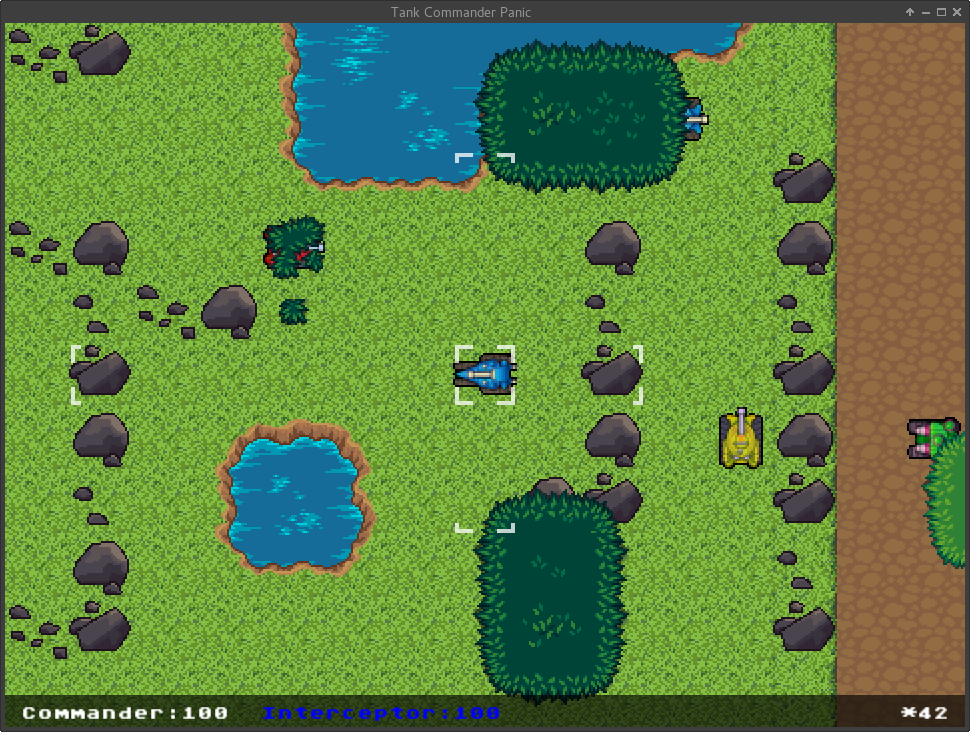

# Tank Commander Panic

Tank Commander Panic is a networked, tile-based RTT (Real Time Tactics) game.

Players have command of up to four tanks but can drive only one at a time,
carefully switching between them to take advantage of each tank's
characteristics on the ever-changing battlefield.

## Dependencies

### Server
- `Boost (1.56 or greater)` is required to compile and run these programs. Both
the development headers and binaries may be installed using the preferred
package manager of your Linux distribution.
- `gcc (v4.9 or greater)` is required to support C++ 14.

### Client
- `Python 3.*` is required for running the python client.
    - `numpy` is required from pip
    - `pySFML` specifically from [https://github.com/joelfad/python-sfml/tree/bugfix](https://github.com/joelfad/python-sfml/tree/bugfix)

## Building

The server and client can be compiled with a provided script:

`./build.sh`

## Running
To run the Server:

`./Server <map>`

To run the Client:

`./Client <host ip>`

## Troubleshooting

If you have any difficulties compiling or running these programs, please let us
(Group 36) know so that we can demonstrate our assignment.

## Development

### Gitflow

The `master` branch is for tagged releases. The `devel` branch is live
development of components outside of the server and client themselves. The
`server` and `client` branches are downstream of `devel`. They are live
development branches for their respective components.

## Documentation

Docs regarding the design of various parts of the system are available under `doc/`.

Sections:

- [Panic Game Protocol specification](doc/panic_game_protocol.md)
- [.map file format specification](doc/map_file_format.md)
