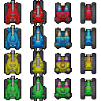

# Panic Game Protocol

This document describes the message format and order for Panic Game Protocol,
the protocol used by Tank Commander Panic. It is built on TCP and allows for
joining games and supports the gameplay.

This is version `2` of the protocol. Protocol version numbers will simply
increment when an incompatible change is made.

## Message Formats

### Client Messages

There is one message format for messages sent from the client.

#### Action Message

This message is sent to inform the server of the player's attempt to take an
action such as move, shoot, or quit. The message format is as follows.

| field         | c type  | size    | description                                         |
|---------------|---------|---------|-----------------------------------------------------|
| `player_id`   | u short | 2 bytes | player's id number, identifies the client           |
| `action_type` | u char  | 1 byte  | enum: `attempt to move`, `attempt to shoot`, `quit` |
| `direction`   | u char  | 1 byte  | enum: `N`, `E`, `S`, `W` (not used when quitting)   |
| `piece_id`    | u int   | 4 bytes | `GamePiece` id number (not used when quitting)      |
| **Total**     |         | 8 bytes |                                                     |

The enums in this message format are defined as follows:

| enum        | value | meaning                 |
|-------------|:-----:|-------------------------|
| action type | 0     | *no action*             |
|             | 1     | attempt to drive        |
|             | 2     | attempt to shoot        |
|             | 3     | quit                    |
| cardinality | 0     | *direction unspecified* |
|             | 1     | North                   |
|             | 2     | East                    |
|             | 3     | South                   |
|             | 4     | West                    |

### Server Messages

There are three formats for messages sent by the server. The first field (1
byte) for all server messages identifies the format of the message and also
carries other information.

| `message_type` value | message type                                           |
|:--------------------:|--------------------------------------------------------|
| 0                    | Game Control Message *(no specification yet designed)* |
| 1                    | Game State Message                                     |
| 2 - 31               | Create Piece Message                                   |
| 32 - 47              | Event Message                                          |
| 48 - 255             | *unreserved (left for future expansion)*               |

#### Game Control Message

*No specification yet. This will be given in a later protocol version.*

#### Game State Message

This format is identified by a `message_type` value of `1`. This message is
followed by **Create Piece Messages** to populate the map. Therefore, existing
`GamePiece`s are discarded by the client when this type of message is received.

| field              | c type  | size               | description                                                     |
|--------------------|---------|--------------------|-----------------------------------------------------------------|
| `message_type`     | u char  | 1 byte             | game stage messages have a type of `1`                          |
| `map_id`           | u char  | 1 byte             | the map id number                                               |
| `map_version`      | u char  | 1 byte             | the version number of the map                                   |
| `player_id`        | u short | 2 bytes            | the player's id number, identifies the client                   |
| `owned_tank_count` | u char  | 1 byte             | the number of tanks controlled by the player, N                 |
| `tank_piece_id`    | u int   | 4 bytes (xN tanks) | the id number of the tank `GamePiece` *(repeated as necessary)* |
| **Total**          |         | 6 + 4N bytes       |                                                                 |

#### Create Piece Message

This format is identified by a `message_type` value of `2` - `31`. It describes
the creation of a new `GamePiece`.

| field                         | c type  | size     | description                         |
|-------------------------------|---------|----------|-------------------------------------|
| `message_type` / `piece_type` | u char  | 1 byte   | `2` - `31` (see below)              |
| `value`                       | s int   | 4 bytes  | (see below)                         |
| `piece_id`                    | u int   | 4 bytes  | `GamePiece` id number               |
| `piece_coord_x`               | u char  | 1 byte   | x coordinate of the new `GamePiece` |
| `piece_coord_y`               | u char  | 1 byte   | y coordinate of the new `GamePiece` |
| **Total**                     |         | 11 bytes |                                     |

`piece_type` is the type of `GamePiece` and also describes aspects of the
`GamePiece` itself. The `value` field's meaning also differs depending on the
type of `GamePiece`:

| `piece_type` value | `piece_type` name | `value` meaning                                                  |
|:------------------:|-------------------|------------------------------------------------------------------|
| 2 - 7              | Brick             | health (used to determine sprite)                                |
| 8                  | Health            | amount (used to determine sprite)                                |
| 9                  | Ammo              | amount (used to determine sprite)                                |
| 10                 | Decoration        | style/sprite                                                     |
| 11 - 15            | *unreserved*      | -                                                                |
| 16 - 31            | Tank              | health (used to determine sprite and display health bars in HUD) |

For bricks, the value of `piece_type` describes the style of the bricks. This is
specified in the table below:

| `piece_type` value | Brick style |
|:------------------:|-------------|
| 2                  | *TBD*       |
| 3                  | *TBD*       |
| 4                  | *TBD*       |
| 5                  | *TBD*       |
| 6                  | *TBD*       |
| 7                  | *TBD*       |

Specific tank colors and models are designated with `piece_type`s in the `16` -
`31` range. The bits in the mask `0x0c` specify the team color and the bits
under `0x03` specify the tank model as shown:

| `piece_type` | Commander      | Interceptor    | Eliminator     | Negotiator     |
|-------------:|:--------------:|:--------------:|:--------------:|:--------------:|
| **Red**      | 0001_0000 = 16 | 0001_0001 = 17 | 0001_0010 = 18 | 0001_0011 = 19 |
| **Blue**     | 0001_0100 = 20 | 0001_0101 = 21 | 0001_0110 = 22 | 0001_0111 = 23 |
| **Yellow**   | 0001_1000 = 24 | 0001_1001 = 25 | 0001_1010 = 26 | 0001_1011 = 27 |
| **Green**    | 0001_1100 = 28 | 0001_1101 = 29 | 0001_1110 = 30 | 0001_1111 = 31 |

#### Event Message

This format is identified by a `message_type` value of `32` - `47`.

| field                         | c type  | size     | description                                              |
|-------------------------------|---------|----------|----------------------------------------------------------|
| `message_type` / `event_type` | u char  | 1 byte   | `32` - `47` (see below)                                  |
| `direction`                   | u char  | 1 byte   | enum: `N`, `E`, `S`, `W` (same as in **Action Message**) |
| `value`                       | s int   | 4 bytes  | (see below)                                              |
| `piece_id`                    | u int   | 4 bytes  | `GamePiece` id number                                    |
| **Total**                     |         | 10 bytes |                                                          |

`event_type` is an enum of the type of event (from the following table). The
`value` field's meaning differs depending of the type of event:

| `event_type` value | `event_type` name   | `value` meaning                | other notes                              |
|:------------------:|---------------------|--------------------------------|------------------------------------------|
| 32                 | Update Ammo         | new ammo count                 | `piece_id` is not specified (set to `0`) |
| 33                 | Update Health       | new health value               | -                                        |
| 34                 | Destroy `GamePiece` | `0` (not used)                 | -                                        |
| 35                 | Move `GamePiece`    | distance `GamePiece` is moved  | only time `direction` is specified       |
| 36                 | Game Start          | `0` (not used)                 | `piece_id` is not specified (set to `0`) |
| 37                 | Game Over           | enum: `you win`, `you loose`   | `piece_id` is not specified (set to `0`) |
| 38 - 47            | *unreserved*        | -                              | -                                        |

**Note:** When a tank fires, an **Event Message** is sent to all players stating
that the tank moved in the direction it fired a distance of 0. This will cause
the tank to point on the correct direction after firing without actually
moving the tank.

### Message Field Sizes

The sizes of message fields were chosen to reflect the range of possible values
each field could possibly take on with future versions of Tank Commander Panic
in mind. We chose to keep the sizes as multiples of whole bytes so that parsing
and interpreting the message formats across languages could be simplified. We
chose the numbers of bytes to match the size of corresponding existing variables
in the server system for some fields and for others we based it on a realistic
number of possibilities.

## Message Order

The order of messages follows two main scenarios: connecting (or reconnecting)
to a game and making a move in the game. Connecting to a game (or reconnecting
to it after loosing a connection) starts a sequence of messages from the server
to the client to bring the client "up to speed" on the state of the game. Making
a move in the game involves sending an action to the server and receiving the
resulting events which are often sent to the all of the clients.

### Connecting to a Game

In this early version of the protocol, when a client connects, if the server is
expecting a new player, this client is assigned to a player with a unique
`player_id`. This is used to identify the players even if their connection is
broken.

The first message sent is a **Game State Message**. It tells the client which
map the game is on (`map_id` and `map_version`) as well as information the
client will need to use for the UI (`owned_tank_count` and `tank_piece_id`'s)
and for communication (`player_id`).

This message is accompanied by a following **Event Message**. It is for an
*Update Ammo* event to tell the client how much ammo the player has.

These messages are followed by a series of **Create Piece Messages**. These
messages populate the map with the `GamePiece`s the game is played with.

#### Connecting to a Full Game

If all players have clients assigned to them, a connecting client will be
assigned a new unique `player_id` which is not connected to a player in the
game. The `owned_tank_count` in the resulting **Game State Message** will be 0.
This is equivalent to being a defeated player who is allowed to continue to
watch the game as the surviving players play on.

#### Reconnecting After a Lost or Broken Connection

If a player's connection is broken and a client later connects, it will, soon
after connecting, send an **Action Message** of any kind which will include the
`player_id` in the message. This will allow the server to associate the new
connection to the original player.

### Making Moves

When the user presses a key to make a move in the client program, like driving a
tank or shooting, the client sends an **Action Message** to the server. This
message is a request to the server to see if the player can drive in the
direction requested or see what will happen if the player's tank attempts to
fire in a given direction.

The response is one or more **Event Messages** sent by the server to one or all
of the clients. For example, if a tank moves successfully, the movement of the
tank will be sent to all clients so that this change can be presented to all
players. Another example is if a tank fires and hits another tank, three
messages will be sent. The first is a *Move GamePiece* event that points the
firing tank in the correct direction (without actually moving it, the distance
is 0). The second is an *Update Health* event for the tank that was hit (sent to
all clients). The third is an *Update Ammo* event (sent to the client of the
player to fired their gun).
